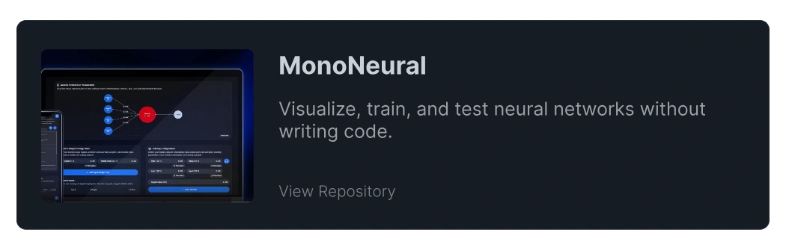
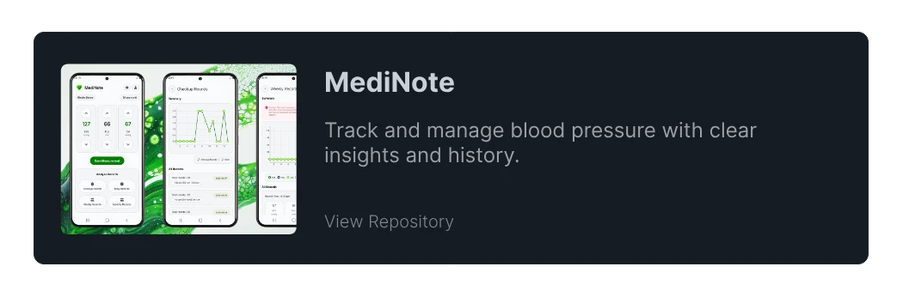
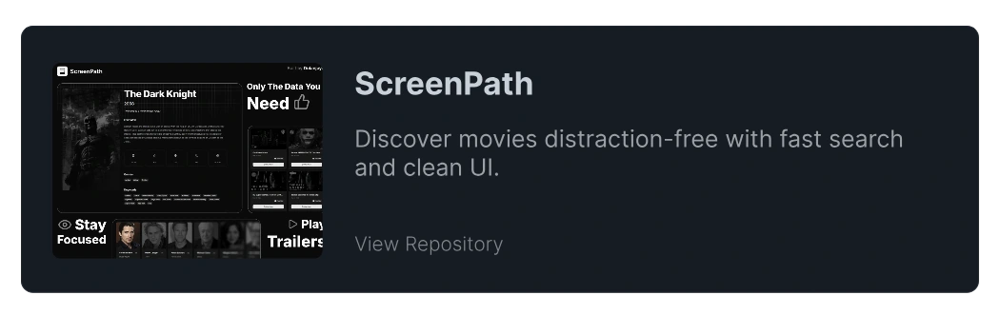
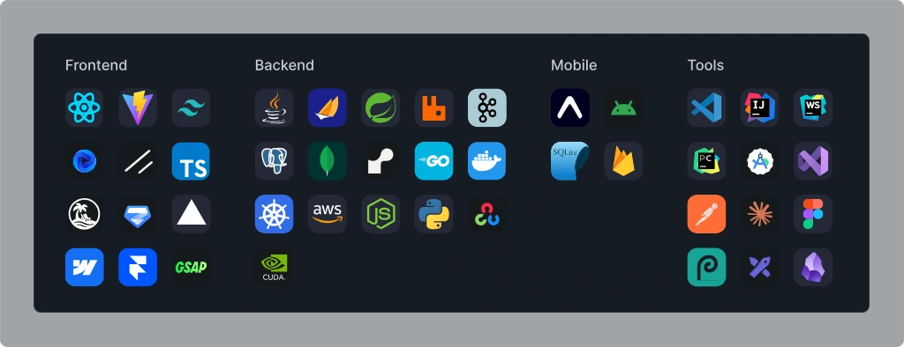
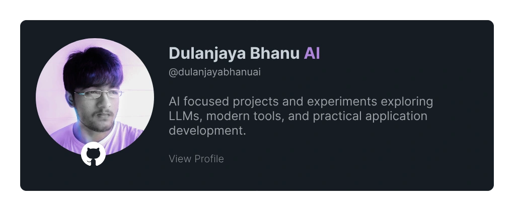

## Hi, I'm Dulanjaya

I’m a Software Engineer focused on building production-grade applications using modern backend, cloud, and full-stack technologies.

### ✦ What I Do

* Design and develop scalable backend systems
* Build full-stack applications with real-world use cases
* Apply production grade practices such as clean architecture, versioning, and deployment
* Continuously explore cloud and modern engineering ecosystems

### ✦ Engineering Approach

Most of my projects are driven by a simple principle:

### ✦ Problem Driven Solutions

    

### ✦ Technologies and Tools

    

### ✦ Current Focus

* Advancing into enterprise-level backend engineering
* Exploring cloud engineering & deployment strategies
* Strengthening system design and scalability patterns

### ✦ Connect With Me

* [Twitter](https://twitter.com/DulanjayaBhanu)
* [Email](mailto:dulanjayawebs@gmail.com)

 

    

 

  
    

